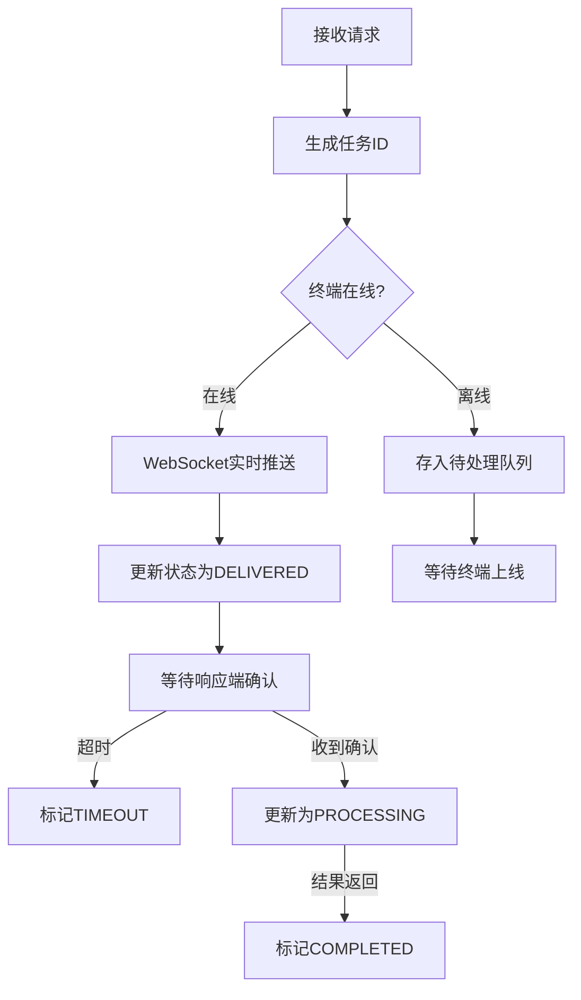
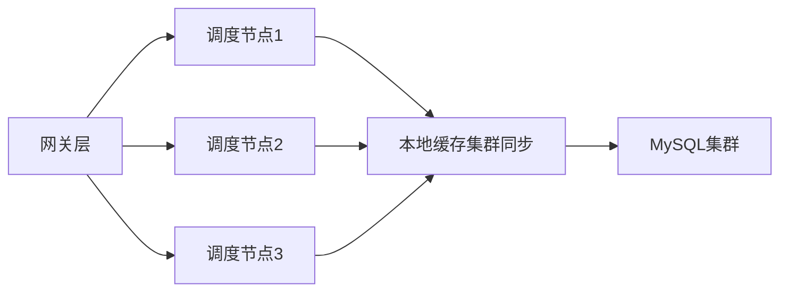

### WebSocket + 本地缓存任务调度系统

---

#### **1. 连接管理模块**
**功能**：管理响应端的长连接状态和心跳检测  
**核心机制**：
- WebSocket连接注册
  - 响应端通过 `wss://domain.com/ws/terminal/{terminalId}` 建立连接
  - 首次连接需携带JWT令牌进行身份认证
  - 成功连接后记录终端ID、连接时间、最后活跃时间戳
- 心跳维护
  - 每30秒响应端需发送心跳包 `{"type":"heartbeat"}`
  - 超时检测：连续60秒无心跳则标记为离线
- 状态存储
  - 在线状态：本地缓存 Map `terminals:online` 存储 `terminalId -> lastActiveTime`
  - 连接池：内存映射 `ConcurrentHashMap<terminalId, WebSocketSession>`

**异常处理**：
- 连接断开时自动清除注册记录
- 离线终端待处理任务转存持久化队列

---

#### **2. 任务调度引擎**
**功能**：全生命周期任务管理  
**工作流**：


**关键设计**：
- 任务ID生成：UUIDv4 + 时间戳前缀
- 状态持久化：本地文件系统按创建时间排序
- 超时控制：后台线程监控处理中任务（默认300秒超时）
- 优先级队列：高优先级任务插队机制

---

#### **3. 接口服务模块**
**HTTP API设计**：
| 端点 | 方法 | 参数 | 响应 | 功能 |
|------|------|------|------|------|
| `/api/task/submit` | POST | JSON任务体 | 201 Created<br>`{"taskId":"xxx"}` | 接收新任务 |
| `/api/task/pull` | GET | terminalId | 200 OK<br>`{"tasks":[taskObj]}` | 响应端拉取任务 |
| `/api/task/result` | POST | JSON结果体 | 202 Accepted | 接收执行结果 |
| `/api/task/query` | GET | taskId | 200 OK<br>`{"status":"", "data":{}}` | 查询任务状态 |
| `/api/terminals` | GET | - | 200 OK<br>`[{id, status}]` | 获取终端列表 |

**WebSocket接口**：
- 响应端通道：`/ws/terminal/{terminalId}`
  - 入站消息：任务确认、心跳、结果提交
  - 出站消息：任务推送
- 请求端通道：`/ws/client/{taskId}`
  - 专属结果推送通道（SYNC_WEBSOCKET模式）

---

#### **4. 缓存管理模块**
**数据结构设计**：
```javascript
// 在线终端
const onlineTerminals = new Map();
onlineTerminals.set('terminal001', 1688888888);

// 任务元数据
const taskMetadata = new Map();
taskMetadata.set('task:meta:T001_xxx', {
  created: '20230805T120000',
  status: 'PROCESSING'
});

// 任务结果
const taskResults = new NodeCache({ stdTTL: 86400 });
taskResults.set('task:result:T001_xxx', {...});

// 待处理队列
const pendingTasks = new Map();
pendingTasks.set('terminal001', ['T001_xxx']);
```

**缓存策略**：
- 一级缓存：内存缓存活跃任务（LRU淘汰）
- 持久化缓存：本地文件系统
- 写穿透：任务状态变更同步更新数据库

---

#### **5. 监控告警模块**
**监控指标**：
- 连接数：在线终端/异常断开
- 任务吞吐：接收量/完成量/延迟分布
- 错误率：失败任务分类统计

**告警机制**：
- 阈值告警：连接数突降50%+ 
- 异常检测：任务超时率>5%
- 通知渠道：Webhook/SMS/邮件

---

#### **6. 集群协同模块**
**分布式设计**：


**关键机制**：
- 节点发现：Consul服务注册
- 负载均衡：Round-Robin + 权重分配
- 数据同步：自定义事件系统跨节点通知
- 脑裂防护：本地分布式锁实现

---

#### **7. 安全控制模块**
**防护机制**：
1. 认证层
   - JWT签名验证（HS256）
   - 终端密钥轮换机制
2. 授权层
   - 终端隔离：响应端仅访问自有任务
   - 角色控制：管理接口RBAC模型
3. 传输安全
   - WebSocket强制WSS
   - 敏感参数AES-GCM加密
4. 审计追踪
   - 全操作日志记录
   - 敏感操作二次确认

---

#### **8. 异常处理模块**
**容错策略**：
| 故障类型 | 处理方案 |
|----------|----------|
| WebSocket断开 | 自动切换HTTP轮询模式 |
| 消息丢失 | 消息重试+幂等设计 |
| 节点故障 | 集群自动故障转移 |
| 存储失效 | 降级为内存模式+本地快照 |
| 网络分区 | 有限服务模式+一致性校验 |

---

此设计文档提供了调度服务器的完整模块划分和功能描述，不包含具体实现代码但包含足够的技术细节，可直接用于指导AI编程实现。每个模块都定义了清晰的输入输出、核心机制和边界条件，确保开发人员能准确理解系统需求。